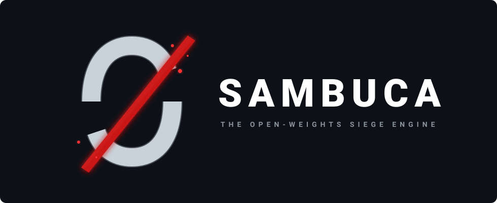

<p align="center">
  
</p>

# 🏰 SAMBUCA: The Open-Weights Siege Engine

> *"Freedom is free. It has no flag, no race, and no borders. It has all the faces at once and none in particular... And now it is also easy!"*

Sambuca is not just a repository; it is a weaponized software appliance and a practical gateway to digital sovereignty. Named after the ancient Roman mobile siege tower that allowed armies to drop an assault bridge directly over impenetrable fortress walls, this project is built to bypass the locked gates of the corporate AI panopticon.

If you are a professional who handles confidential data—or simply a consumer who refuses to rent back stolen human history by the token—you are in the right place.

---

## ⚡ The Concept: Drop the Ramp (No Coding Required)

The ultimate barrier to digital sovereignty has always been complexity. We accepted corporate cages because the alternative required compiling Linux kernels in a terminal.

Sambuca is designed to completely obliterate that barrier. It is a turn-key installer designed so that anyone can deploy a sovereign, air-gapped AI server without writing a single line of code.

**How it works:**

1. Download the Sambuca app on your Mac or Windows machine.
2. Plug in a blank USB stick and hit “Flash.”
3. Plug that USB stick into a dedicated machine—an old discarded laptop, an office PC, or a high-end dual-GPU rig—and turn it on.
4. Walk away.

The Sambuca installer takes over entirely. It automatically wipes and encrypts the drive, installs a headless Linux OS, profiles your exact hardware, and downloads the smartest open-weights AI model your machine can physically run. It configures a beautiful, one-click graphical dashboard, installs free replacements for predatory cloud services, and wires up a private mesh network so you can access it securely from anywhere on Earth.

It does the work of a senior systems administrator in twenty minutes, completely offline, and hands you the master password.

## 🏗️ The Architecture

Under the hood, Sambuca orchestrates a robust, open-source stack that prioritizes privacy, efficiency, and zero-trust security:

* **The Base OS:** A minimal, headless Debian 12 environment with military-grade LUKS disk encryption.
* **The Hardware Profiler:** A dynamic auto-scaling daemon that detects your CPU, RAM, and GPU VRAM on first boot, automatically pulling the optimal quantized models to prevent out-of-memory crashes.
* **The AI Engine:** Ollama serving as the local backend, paired with **Odysseus** as the highly capable, aesthetically pleasing web frontend for interacting with your models.
* **The Application Mesh:** A CasaOS graphical dashboard managing a pre-wired Docker Compose ecosystem.
* **The Sovereign SaaS Suite:** Pre-configured self-hosted alternatives, including Vaultwarden (passwords), Nextcloud AIO (files/calendars), Immich (local ML photo backup), and encrypted IRC/Matrix servers.
* **Zero-Config Networking:** Tailscale is baked directly into the core, creating a secure peer-to-peer mesh network. No opening router ports, no complex firewall rules.

---

## 📜 The Genesis: Defeating the Rubber Stamp

This project was born in the wake of the 2026 Annual General Meeting of the Law Society of British Columbia and the glorious defeat of *Resolution 7*.

Risk-averse regulators and institutional bodies are terrified of AI. Their instinct is to slap a "certified safe" sticker on proprietary cloud vendors and demand that professionals outsource their judgment to a bureaucratic committee. But handing your clients' strictly confidential data to a black-box corporate server is an abdication of professional duty.

We do not need a Law Society hall pass to understand software. We need to reclaim our silicon.

## 👁️ The Corporate Panopticon vs. True Sovereignty

Every tech giant currently pitching "safe, enterprise-grade AI" achieved their breakthrough by brazenly scraping the copyrighted internet. They strip-mined our collective history, locked it inside a corporate black box, and now rent it back to us as a monthly API subscription.

* **The Phantom Asset:** You buy incredibly capable hardware, only to find it hollowed out by subscription gates, telemetry pipelines, and corporate spyware serving a shareholder's bottom line.
* **The Palantir Problem:** Entrusting commercial AI providers with sensitive data accelerates a mass-surveillance state. The leap from helpful chatbots to global surveillance networks is moving faster than the leap from medical X-rays to nuclear missiles.
* **The Aaron Swartz Scale:** While pioneers like Aaron Swartz were crushed by the state for attempting to liberate paywalled academic papers, tech monopolies ingested millions of times that amount of data without a single indictment, achieving billion-dollar valuations.

## 🌉 The Siege Engine (Why Open-Weights?)

In early 2023, out of pure corporate spite to kneecap his rivals' pricing power, Mark Zuckerberg accidentally committed the greatest benevolent act in modern tech history: he released Meta’s multi-billion-dollar LLaMA models to the public. He dropped a free, fully assembled, race-grade V8 engine onto the front lawn of every human on Earth.

That single decision breached the corporate firewall. **Open-weights AI is our Sambuca.**

When you run open-weights AI, you realize something fascinating: **neural networks are mathematically master-less.** They actively resist top-down corporate manipulation. The smarter they get, the harder it is to force them to lie.

## 🩸 The Cost of Freedom

Is digital sovereignty entirely "free"? No.

Sambuca solves the software friction—you no longer have to lose entire weekends screaming at your terminal wrestling with Python dependencies. But the hardware still demands a sacrifice. Buying a high-end graphics card to run massive AI models locally will burn a smoking hole in your wallet.

But there is a very fair reason for that friction: it is the literal cost of escaping the corporate panopticon. You are buying your way out of the matrix.

---

# Reference

Everything above is why. Everything below is what it actually does, and how
to run it.

Deeper detail lives in five documents: [ARCHITECTURE](docs/ARCHITECTURE.md) (the
three network planes, the boot sequence, the VRAM arbitration),
[SECURITY](docs/SECURITY.md) (the threat model and the compromises made on
purpose), [MAINTENANCE](docs/MAINTENANCE.md) (**every coupling to something we
do not control, and what watches it**), [HARDWARE](docs/HARDWARE.md) (which tier
your machine lands in) and [IMAGES](docs/IMAGES.md) (the pinning policy).

## What it replaces

| You were paying for | It runs |
|---|---|
| ChatGPT / Claude subscriptions | **Ollama + Odysseus** — 3B to 70B, sized to your hardware |
| Google Drive / Dropbox / M365 | **Nextcloud AIO** — files, docs, calendar, contacts |
| Google Photos / iCloud Photos | **Immich** — local face recognition and semantic search |
| 1Password / LastPass | **Vaultwarden** |
| Notion / Obsidian Sync | **Blinko** — notes, with the local model doing the AI part |
| Adobe Acrobat online | **BentoPDF** — in-browser, the file never leaves the tab |
| Slack / Discord | **Ergo IRC** + **Matrix Synapse** |
| A NAS vendor's cloud | **MergerFS + SnapRAID** on whatever mismatched disks you have |
| Cloudflare Tunnel / a VPS | **Tailscale + Caddy** |
| Uptime monitoring SaaS | **Uptime Kuma** |

---

## Quickstart

```bash
pip install ./apps/flasher
```

```bash
sambuca-flasher example-config --output my-appliance.json
```

```bash
sudo sambuca-flasher write --iso debian-12-netinst.iso --config my-appliance.json
```

The flasher generates a 24-word seed phrase and a 32-character root passphrase
**on your machine, offline**, writes them to `liberator-recovery.pdf`, and only
then touches the USB. Print the PDF. It is the only copy.

Boot the target machine from the stick. You get **30 seconds at the console**,
with the target disk and its current contents printed on screen, to abort before
anything is written.

Then it installs itself. First boot pulls models and starts the stack — an hour
on a good connection, longer on a slow one — and prints a completion report
telling you where everything is.

---

## Repository layout

```
sambuca/
├── apps/flasher/                    Cross-platform USB writer (Windows/macOS/Linux)
│   ├── src/sambuca_flasher/
│   │   ├── keys.py                  BIP-39 seed + root passphrase + backup key derivation
│   │   ├── payload.py               provision.json construction + the secret-leak guard
│   │   ├── recovery_pdf.py          the printed recovery document
│   │   ├── devices.py               removable-device enumeration (internal disks never listed)
│   │   ├── writer.py                raw image write + readback verification
│   │   └── cli.py                   the write flow, in the order it must happen
│   └── tests/
│
├── engine/
│   ├── autoinstall/                 Unattended Debian 12 installation
│   │   ├── preseed.cfg              full-disk LUKS, no hardcoded target disk
│   │   ├── disk-select.sh           resolves the target, or REFUSES — never guesses
│   │   ├── abort-countdown.sh       the 30-second fail-safe
│   │   ├── late-command.sh          stages the engine into the installed system
│   │   ├── enroll-recovery-key.sh   adds the seed-derived SECOND LUKS keyslot, in the installer
│   │   ├── luks-tpm-enroll.sh       optional TPM 2.0 auto-unlock (opt-in, with the tradeoff stated)
│   │   └── build-iso.sh             rebuild a netinst ISO with the payload embedded
│   │
│   ├── hardware-detect.sh           ★ the profiler: CPU/RAM/VRAM → tier → model set → resource limits
│   ├── first-boot.sh                ★ the provisioning orchestrator (resumable, idempotent)
│   ├── lib/common.sh                logging, error traps, atomic writes, single-instance enforcement
│   ├── profiles/tier{1..4}.env      the model catalogue, as data
│   │
│   ├── provision/                   phases, run in order by first-boot.sh
│   │   ├── 10-system.sh             base OS, users, ssh, sysctl, unattended security upgrades
│   │   ├── 20-docker.sh             Docker CE + compose plugin + daemon hardening
│   │   ├── 30-gpu-runtime.sh        NVIDIA/ROCm runtime, then RE-PROFILES the hardware
│   │   ├── 40-storage-pool.sh       MergerFS union + SnapRAID parity (never formats a disk with data)
│   │   ├── 50-network.sh            Tailscale, CasaOS port move, nftables default-deny
│   │   ├── 60-stack.sh              renders .env, validates, brings the mesh up, health-gates
│   │   ├── 70-models.sh             pulls the tier's models, then proves generation works
│   │   ├── 80-identity.sh           Pocket ID bootstrap (one attended step, honestly labelled)
│   │   └── 90-report.sh             the completion report
│   │
│   └── maintenance/
│       ├── gitops-sync.sh           signed-tag-only config sync, with a forbidden-path review gate
│       ├── backup.sh                restic, with correct exit-3 handling and restore verification
│       ├── snapraid-sync.sh         parity sync with a deletion threshold that aborts
│       ├── recovery-key.sh          sambuca-recovery {status,enrol,verify} — prove the key works
│       └── systemd/                 units and timers
│
├── compose/
│   ├── docker-compose.yml           core: Caddy, Pocket ID, oauth2-proxy, Uptime Kuma, Watchtower
│   ├── ai.yml                       Ollama + Odysseus
│   ├── cloud.yml                    Vaultwarden, Nextcloud AIO, Immich
│   ├── office.yml                   Blinko, BentoPDF
│   ├── comms.yml                    Ergo, Synapse
│   ├── gpu.<profile>.<bundle>.yml   per-bundle GPU overrides; only enabled bundles are appended
│   ├── .env.example                 image pins — see docs/IMAGES.md before releasing
│   └── config/                      Caddyfile, ircd.yaml, snapraid.conf template
│
├── apps/companion/
│   └── setup/index.html             the setup screen the owner watches while it provisions
│
├── assets/brand/
│   ├── sambuca-header.svg           README header
│   ├── sambuca-mark.svg             square mark: favicon, tray, avatar
│   └── loading-treads.*             the siege-tread loop shown during long steps
│
├── tools/
│   ├── verify-images.py             resolve every image against its registry (no docker needed)
│   └── check-upstreams.py           daily drift check across every external coupling
│
└── docs/
    ├── ARCHITECTURE.md              the three network planes, boot sequence, VRAM arbitration
    ├── SECURITY.md                  the threat model, and the tradeoffs made on purpose
    ├── MAINTENANCE.md               every coupling we do not control, and what watches it
    ├── HARDWARE.md                  what tier your machine lands in, and why
    ├── IMAGES.md                    image pinning policy
    └── design/
        └── NEXT-STAGE.md            the three development axes, as decisions
```

---

## Hardware tiers

`engine/hardware-detect.sh` runs at first boot, again after the GPU driver
installs, and on every subsequent boot. It measures rather than assumes, and an
unknown value downgrades the tier instead of being optimistically guessed.

| Tier | Trigger | Chat model | Photo ML |
|---|---|---|---|
| **1** heavy GPU | ≥ 24 GB VRAM | 32B q4 · 70B q4 above 40 GB | GPU |
| **2** mid GPU | 12–23 GB VRAM | 14B q4 | **CPU** |
| **3** cpu capable | ≥ 8 cores, ≥ 24 GB RAM | 8B q4 | CPU |
| **4** low resource | anything else | 3B q4 | CPU |

**The VRAM arbitration rule:** the inference engine owns the GPU; background ML
is a guest. Below 20 GB of VRAM, Immich's face-recognition and CLIP worker is
pinned to the CPU — no negotiation, no "try GPU first" fallback. Two allocators
that each believe they own the card is how a self-hosted box OOMs at 3am in the
middle of a library import. Above that threshold Immich gets the GPU, and
Ollama's keep-alive is bounded so idle VRAM is actually returned.

Override anything in `/etc/sambuca/profile.local.env` — it is sourced after the
generated profile and survives regeneration.

---

## Design commitments

These are the decisions the code is built around. Each one costs something.

**Nothing phones home.** No analytics, no crash reporting, no license check. The
flasher makes zero network requests. Odysseus is configured with remote
providers disabled.

**The paper is sufficient.** The backup repository password AND a disk recovery
key are both derived from the 24-word seed with versioned HKDFs. With the
printed sheet alone you can open the disk on a machine whose passphrase has been
forgotten, and restore your data on a machine that has never heard of this
project.

**No single point of failure that is one string on one sheet.** The disk has two
independent keyslots — the root passphrase and the seed-derived recovery key.
Either opens it; neither can be computed from the other. `sambuca-recovery
verify` proves the key works *before* you need it, because a keyslot that exists
is not a keyslot that works.

**The installer refuses rather than guesses.** No hardcoded `/dev/sda`. If the
disk selection rules do not produce exactly one answer, installation stops and
tells you why.

**Failures are loud.** `restic` exit code 3 means a *partial* backup and is
reported as a failure, not logged as `done OK`. Backups are verified by
restoring a file, not by trusting an exit code. The snapraid sync aborts if an
abnormal number of files were deleted, because syncing would destroy the parity
that could undo the damage.

**The auth gate fails closed.** Until a passkey is enrolled, gated routes return
503. Passkey enrolment cannot be automated — anything claiming otherwise has
left a password-equivalent bootstrap secret on the disk — so it is one clearly
labelled attended step, and everything with its own login works in the meantime.

**Updates are followed, not obeyed.** The nightly sync fetches, verifies a
signed tag, refuses changes to disk/firewall/backup paths without human review,
applies, validates, and rolls back on failure.

---

## Status

Early, but not vapour. **CI is green** — shellcheck, the flasher suite on
Linux/macOS/Windows across Python 3.11 and 3.13, Caddyfile validation, compose
rendering for all 48 GPU-profile × bundle-subset combinations, and live registry
resolution of every container image — digests recorded in
[docs/IMAGES.md](docs/IMAGES.md). 25 tests pass, including pinned derivation
vectors for both seed-derived keys.

Two things are honestly outstanding:

- **`ODYSSEUS_IMAGE` is not published yet.** Until it is public on GHCR, the
  `ai` bundle starts Ollama with no frontend. Everything else runs.
- **Images are pinned to tags, not digests.** Tags are the development
  convenience; `make pin-images` converts them to digests, which is what makes
  a flashed USB reproducible. Do that before cutting a release tag.

And the honest headline: **no machine has yet been installed end-to-end from a
flashed stick.** The install path is reviewed, syntax-checked, linted by three
independent toolchains and reasoned through, but unproven on real hardware.
Treat it accordingly until someone reports otherwise — and if you are the first
to try it, open an issue either way.

That gap is not modesty. Every serious bug found so far was found by a machine
running the code, not by anyone reading it: a `local` declaration that gave four
databases the same password, CRLF line endings that made the abort countdown
unrunnable, a `read -t` that would have hung the installer where it is not
implemented. Reading is not verification.

---

## 🧭 Where this is going — three development axes

Everything after the first working appliance is organised along three axes. They
are not phases to be completed in order; they are standing directions, and every
change should advance one of them without regressing the other two. The full
decision document — what gets built, what gets **rejected**, and why — is
[docs/design/NEXT-STAGE.md](docs/design/NEXT-STAGE.md).

### 1. User-friendliness — take the novice all the way

**The hard part of de-Googling is not the server. It is the fourteen small
migrations afterwards:** contacts, calendar, photos, mail, passwords, files, the
phone, the second phone, the spouse's laptop. Every self-hosting project ships
the server and abandons you at exactly the point where the work starts. That
abandonment is the whole reason self-hosting has a reputation for being for
hobbyists.

So the target is not a flasher with a nicer window. It is a **companion that
persists after installation and drives the migration to completion** — served by
the appliance, opened from any browser, because the migrations happen on phones
and laptops, not on the machine that wrote the USB.

That split gives the desktop app exactly one job after the USB is written:
**recovery**. It is the thing you still have when the appliance will not boot.

- **A checklist with memory.** Close the tab, come back tomorrow, it knows where
  you were. The single most important feature, and the one always missing.
- **The certificate wall, solved rather than explained.** Per-platform trust
  profiles, not a paragraph about trust stores. This is where every novice
  trips first.
- **QR codes for every phone step.** Pointing a camera at a screen succeeds
  where typing a URL into a phone browser and hitting a cert warning does not.
- **Verified, not asserted.** Each step ends with the appliance *checking* the
  client actually connected and the first photo actually synced. A checklist
  that only records clicks is a checklist that lies.
- **Mail: inbound sovereign, outbound relayed.** You forward your mail to a
  provider, the appliance continuously drains it into a local archive you own,
  and sends through that provider's SMTP. The insight that makes this work: *a
  mailbox that is drained every few minutes is a transport, not a store* — so
  free tiers are fine, storage limits stop mattering, and provider trust matters
  far less because nothing sits there. Optional drain-and-delete, off by default
  and behind a dry run. **No Google Cloud Console** — Gmail needs an App
  Password, six clicks, and Takeout covers the history. We do not run an MX:
  home-IP deliverability is not controllable, and a mail server that silently
  drops mail is worse than none.
- **Signal and WhatsApp alongside IRC.** Encrypted comms that only reach other
  sambuca owners are a toy. Matrix bridges put Signal, WhatsApp and IRC in one
  client. Bridges terminate end-to-end encryption to re-encrypt into Matrix —
  which on a hosted bridge means a stranger reads your messages, and here means
  *your own hardware, on your own tailnet, on an encrypted disk*. WhatsApp
  bridging also breaks Meta's terms and carries a small but real ban risk; it is
  off by default and says so in those words before showing you a QR code.
  Bridges are **Tier 1** in the [maintenance register](docs/MAINTENANCE.md):
  they break silently, they are the one coupling no script can watch, and they
  do not ship without a health monitor and a named human tracking upstream.
- **Every stage says what is happening.** An unattended installer that prints
  nothing but log lines is indistinguishable from a hung machine, and an owner
  who power-cycles during disk provisioning corrupts the install. So each step
  states what it is doing, how long it takes, what you should do (usually
  nothing — and saying so is the point) and what comes next; on failure, what it
  means and the exact command to resume.

### 2. Security — a fortress that can also be unbricked

State of the art is not only about keeping attackers out. It is equally about
what happens when the *owner* makes a mistake, because an appliance nobody can
recover is one that eats somebody's photo archive.

- **Done: the disk has two independent keys.** Forgetting the master password
  used to mean permanent, total data loss. It now means typing the recovery key
  from the same sheet. See the design commitments above.
- **A recovery vault for when the sheet is gone too.** The desktop app keeps an
  encrypted copy of the key material, unlocked by three questions only you can
  answer, on your own machine and nowhere else. Because the answers are
  low-entropy, the key derivation is deliberately brutal — memory-hard, seconds
  per attempt. And because the vault is a second complete copy of every secret,
  the app says so plainly: whoever has your laptop *and* guesses the answers has
  your disk. Opt-in, deletable, and never an escrow that leaves your hardware.
- **Update control that is rigorous about what it swallows.** Signed tags and
  forbidden-path review already ship. Next: diff size and shape limits, refusal
  of any update introducing something key-shaped, **no new outbound host without
  human review** (supply-chain compromise almost always needs to phone
  somewhere), digest-drift detection, and a rollback path *exercised in CI
  against a deliberately poisoned update* — because a recovery path nobody has
  run is a recovery path that does not work.
- **Rescue mode on the same USB.** Boot the stick, unlock with either secret,
  and get a menu: repair the bootloader, re-run a phase, copy the data off,
  reset the passphrase. Today the answer is "boot Debian rescue and know what
  you are doing", which is not an answer for this audience.

### 3. Perfected setup — hardened variants, never stock

Where a stock component's defaults are wrong for a machine holding confidential
work, the appliance ships a hardened variant instead of the stock one.

**The worked example is the generative stack.** Stock ComfyUI accumulates inputs
and outputs on disk forever, executes custom nodes fetched at runtime, and
reaches the internet freely. For a box holding client documents that is three
unacceptable defaults in one container. The sambuca variant:

- **Ephemeral by container lifecycle, not by timer.** One disposable container
  per session: `--rm`, read-only rootfs, inputs and outputs on tmpfs *inside*
  it. The session ends, the container dies, and the I/O is gone by construction.
  A purge timer is a promise; a destroyed container is a fact. Deletion is the
  default and retention the exception — the inverse of every stock setup.
- **No runtime node installation** — nodes pinned at build time. A generative
  server that can `pip install` from a workflow file is remote code execution
  with a nice UI.
- **No egress** — models are fetched and verified during provisioning and
  mounted read-only; at runtime the container has no network namespace at all. A
  workflow cannot phone home because there is nowhere to phone from.
- **The cost, stated:** a cold model load per session, tens of seconds for a
  large checkpoint. That is the correct side of the bargain when the alternative
  is a client's document sitting in an output folder six months later.
- **Under the same VRAM arbitration as everything else** — inference first,
  generative second, background photo ML last, rather than a fourth actor that
  believes it owns the card.

**And the machine runs as lean as it can.** Nothing idles that was not asked
for; spare RAM is spent on making storage fast — tmpfs scratch and zram, sized
from measured hardware by the same profiler that sizes everything else, with a
hard floor so a large render cannot squeeze Postgres into the OOM killer. "Lean"
is a number in `profile.env` you can check, not an adjective in a README.

### Where to help

The Call to Action below asks for UI polish, Bash scripting and hardware
testers. Mapped onto the axes: **UI polish is axis 1** (the companion's
checklist and migration flows — the highest-leverage work in the project).
**Bash scripting is axes 2 and 3** (update guards, rescue mode, the memory
plan). **Hardware testing is all three at once**, and is the single thing this
project needs most: nobody has yet installed it end-to-end from a flashed stick.

---

## 🚀 Call to Action

Do not wait for a tech company to tell you where North is. Do not wait for a regulator to rubber-stamp your tools.

* **Educate Yourself:** Learn the difference between closed-code cloud APIs and open-weights local hosting.
* **Experiment:** Flash a Sambuca drive and reclaim your discarded hardware.
* **Build:** Contribute to the hive mind. We need UI polish, Bash scripting, and hardware testers.

Humanity stands at a critical fork in history. A choice between unprecedented empowerment on a corporate dog leash, or true, sovereign capability. The siege engine is built. The bridge is primed.

**Drop the ramp.**

---

## Licence

AGPL-3.0-or-later. Software that exists to keep you out of someone else's walled
garden should not be usable to build one: the network-use clause means a company
cannot take Sambuca, run it as a hosted product, and give nothing back.
