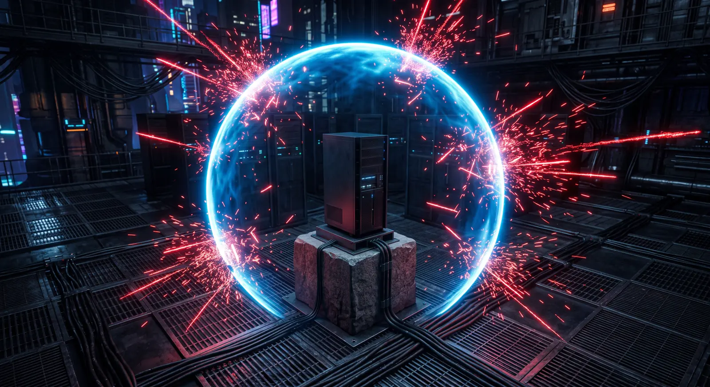

# The AI plane

  

The AI is not a chatbot bolted onto a file server. It is the layer through
which a non-technical owner uses and administers the machine, and it is built
to a different shape on every class of hardware.

This document is the design. What is actually working is in the status table at
the bottom, and it is shorter than what is described here.

> **The three axes this is measured against**
> **1. User-friendliness** — a complete novice, taken by the hand, start to finish.
> **2. Security** — a fortress that can also be unbricked.
> **3. Perfected setup** — hardened variants, ephemeral by construction, lean.

---

## What it does, in the order an owner meets it

1. **It talks.** A private assistant that reads the owner's own documents and
   never sends a word anywhere.
2. **It draws.** A sentence becomes a picture, with no node graph, no negative
   prompts and no LoRA hunting.
3. **It runs the machine.** "Add my new laptop." "Sam has left." The complex
   server operations that normally require a wiki page happen by speech.

The third is the one that matters most and is talked about least. A sovereign
appliance that only an administrator can administer is not sovereign — it has
just moved the dependency from Google to whoever set it up.

---

## 1. Scaffolding, per tier

The single most common way self-hosted AI disappoints is that it offers the
same interface on every machine and lets the hardware decide whether it is any
good. A 3B model behind a blank chat box is a bad product. The same 3B model
behind a narrow, well-scaffolded task is a useful one.

So the *interface* changes with the hardware, not just the model:

| Tier | Chat | Pictures | Steward |
|---|---|---|---|
| **1 — 24 GB+ VRAM** | 32B, or 70B above 40 GB | FLUX.1-schnell, seconds | Free-form speech |
| **2 — 12–23 GB VRAM** | 14B | FLUX.1-schnell, low-VRAM | Free-form speech |
| **3 — capable CPU** | 8B | Opt-in, minutes per picture | Speech, narrower phrasings |
| **4 — low resource** | 3B | Not offered | Guided menus with a speech box |

Tier 4's Steward is the interesting case. A 3B model is not reliable at
free-form intent extraction, so it is not asked to do that. It is asked to pick
one verb from a closed list — which is a classification problem small models
are genuinely good at, especially with constrained decoding — and the interface
around it is a menu that the speech box *filters*, rather than a chat window
pretending to be more capable than it is.

Every tier keeps the same underlying verb catalogue. The scaffolding differs;
the safety model does not.

### The catalogue is trimmed to the machine

`image.generate` is absent from the catalogue on a machine that cannot generate
images. Not disabled, not erroring on use — **absent**, so the Steward answers
"this machine cannot do that" immediately instead of accepting the request and
failing four minutes later. The same rule applies to any future verb whose
subsystem is tier-gated.

---

## 2. Pictures

### The model

**FLUX.1-schnell, Apache-2.0.**

Chosen against two obvious alternatives, on licence grounds as much as quality:

| Candidate | Licence | Verdict |
|---|---|---|
| **FLUX.1-schnell** | **Apache-2.0** | **Shipped.** Genuinely free, and strongly prompt-adherent. |
| FLUX.1-dev | `licence: other`, non-commercial | Rejected. A lawyer's office is a commercial setting. |
| SDXL | OpenRAIL++-M | Rejected. Use restrictions; also weaker at plain-language prompts. |

The free-software audit in [IMAGES.md](../IMAGES.md) has to pass on the
**weights**, not just on the containers. A model an owner may not use for their
own business has no place in an appliance sold as sovereignty.

**It is not fetched from the official repository.** `black-forest-labs/FLUX.1-schnell`
is gated and returns `401` to an anonymous request — verified 2026-08-20. A
walk-away installer that stalls behind a Hugging Face account is not a
walk-away installer. The Comfy-Org repackage is the same Apache-2.0 weights,
ungated, in one self-contained file, pinned by SHA-256.

### One model, one workflow

The GGUF quantisations are 5 GiB smaller and were the intended choice until the
loader turned out to be a third-party custom node with no tagged releases and
no commits since January. An unmaintained extension inside an appliance meant
to run untouched for years is a worse trade than 5 GiB of disk.

So: the same checkpoint on every tier, and only ComfyUI's memory mode changes —
`--normalvram`, `--lowvram`, `--cpu`. One code path, three settings.

### The owner never sees ComfyUI

ComfyUI is a professional tool and a novice bounces off it in seconds. It runs
headless behind a shipped workflow; the human surface is a sentence. The chat
model expands "a birthday card for my mum, she likes gardening" into a prompt
that FLUX responds well to — which is scaffolding doing real work, because
FLUX wants natural language and most people write tag soup out of habit learned
from older models.

The graph is still reachable, gated, at `art.<domain>`, because someone who
already knows what a KSampler is should not have to fight the appliance.

Three values in the shipped workflow are deliberately **not** exposed:

| Fixed | Why |
|---|---|
| `cfg: 1.0` | schnell is guidance-distilled. Raising cfg does not make it follow the prompt harder; it makes the picture fall apart. The most common way people "tune" FLUX into garbage. |
| `euler` / `simple` | The pairing it was distilled against. |
| Empty negative prompt | At cfg 1.0 the negative branch does nothing. A control that does nothing is worse than no control. |

### Hardening that differs from every ComfyUI guide

- **Models mounted read-only.** A generation request cannot rewrite weights.
- **Outputs on a tmpfs.** Pictures live in RAM until the owner saves one. This
  is the auto-deletion axis enforced by the mount, not by a cron job that can
  silently stop running.
- **The custom-node installer is unreachable.** Installing a node is arbitrary
  code execution, and "just paste this node pack" is the likeliest route to an
  owner being compromised.
- **Metadata stripped.** ComfyUI embeds the full prompt and workflow in saved
  PNGs, and that travels with the picture when it is shared.

### The GPU handoff

The rule for *background* ML is "the inference engine owns the GPU, the guest
yields". That rule does not transfer here, because image generation is not
background work — a human is watching a progress bar.

So the rule is a handoff:

| Mode | When | Behaviour |
|---|---|---|
| `coresident` | budget ≥ 40 GB | Both models stay resident. Nothing is unloaded. |
| `handoff` | below that | The chat model is evicted before a generation and reloads on the next message. |
| `none` | CPU, or no image plane | No contention. |

In handoff mode the chat model's keep-alive is bounded, because a 30-minute
keep-alive means the first picture either waits half an hour or races it.

Without this, both allocators see "free VRAM" at the moment they ask, and the
failure lands mid-generation as an out-of-memory abort rather than at the point
where the decision was actually made.

### Guards that fire before anything is promised

- **VRAM floor.** A tier is a claim about a *class* of machine, not a
  measurement of the card in this one. A forced tier, or a card at the bottom
  of tier 2, can select a model the GPU cannot hold. The measured budget is
  checked against the model's real footprint, and the plane is downgraded to
  `--lowvram` or disabled outright.
- **Disk guard.** The checkpoint is 16 GiB — the largest single download the
  appliance ever makes. It is counted in the disk sum. If space is short the
  drop order is fixed and stated: image plane, then vision, then code. Not
  because that ranking is universally right, but because a predictable rule an
  owner can read beats a clever one they cannot anticipate.
- **Verified download.** Resumable, digest-pinned, and atomic — it lands on a
  `.part` path and is renamed only once the SHA-256 matches. `curl` exiting 0
  means bytes arrived, not that the right bytes did.
- **Never fatal.** A failed image download does not fail the install. An owner
  who lost their file server because an optional 16 GiB fetch timed out would
  be right to be furious.

---

## 3. The Steward

The owner says what they want. Complex server operations happen. No wiki page,
no `docker compose`, no forum thread from 2019.

> "add my new laptop"
> "Sam has left, take his access away"
> "make Priya an administrator"
> "my phone was stolen"
> "are my backups any good?"

### The rule that makes it safe

**The model picks a lever. It never has hands.**

The language model does exactly one thing: choose a verb from
[`engine/steward/verbs.yml`](../../engine/steward/verbs.yml) and fill in its
parameters. It does not emit shell. It does not emit SQL. It does not compose
an API call. Its entire output is validated against a schema before anything
runs, and a verb that is not in the catalogue cannot be invoked by any phrasing
whatsoever.

This matters because a model that reads the owner's files, mail and calendar
can be *talked to* by anyone who gets text in front of it — a filename, a
calendar invite, a PDF from opposing counsel. Prompt injection is not
hypothetical on an appliance whose entire purpose is ingesting documents.

The defence is structural, not clever:

1. **The catalogue is closed.** Injected text can at worst cause an existing
   verb to be *proposed*. It cannot invent one.
2. **Blast radius is declared.** Anything above `additive` is confirmed.
3. **The confirmation shows the resolved action** — real names, real paths —
   not the sentence the owner typed. An injection that smuggles in different
   arguments has to survive the owner reading them.
4. **Secrets never return through the model.** A minted auth key goes to the
   screen. The audit log records that a key was issued, not what it was.
5. **The Steward cannot edit its own catalogue, its privileges, or the audit
   log.** A guard that can rewrite its own guard is not a guard.

### What is deliberately out of reach

Not missing features — excluded, each with a stated reason, and for each one
the Steward's job is to explain how the owner does it by hand:

disk encryption and key slots · the certificate authority · the verb catalogue
and the Steward's own privileges · the audit log · deleting a person's files ·
firewall rules, tailnet ACLs and SSH config · anything that sends data off the
machine.

The last one is not there because it is dangerous to the machine. It is there
because it is the one promise the whole appliance makes. There is no verb for
it, so there is no phrasing that produces it.

### Two separations worth naming

**Removing access does not delete data.** An administrator removing a colleague
at 5pm on a Friday should not be destroying files with the same sentence.
Deleting the data is a separate, excluded operation.

**Revoking a stolen phone confirms at `standard`, not `strong`.** This is what
someone runs in a panic, and a wall of friction at that exact moment is a
security failure, not a security feature. It is also trivially reversible.

### The safety rules are enforced, not asserted

[`tools/steward-lint.py`](../../tools/steward-lint.py) runs in CI and fails the
build on: a disruptive verb that does not confirm; a verb claiming to be
reversible while naming no reversal; a reversal pointing at a verb that does
not exist; a read-only verb with a blast radius; an enum default outside its
own values; an unbounded string parameter; a secret-issuing verb with no
documentation of where the secret goes.

It was written before the catalogue was finished and immediately caught a real
omission in it — `user.reset_access` issued an enrolment link without saying
where it went.

---

## Status — what is real

Honest, because the rest of this document reads like a finished product and it
is not one.

| Piece | State |
|---|---|
| Per-tier model catalogues, image models as data | **Built.** Profiler runs, all four tiers verified. |
| VRAM floor, disk guard, drop order | **Built and exercised** — the floor was found by running the profiler on an 8 GB card. |
| GPU handoff decision | **Built** — the decision is computed and emitted. The unload/reload protocol it describes is **not implemented**. |
| ComfyUI service, overlays, gated route | **Written, renders in CI.** Never started on real hardware. |
| FLUX workflow graph | **Written against documented node interfaces. No picture has come out of it yet.** |
| Checkpoint fetch, digest-pinned and atomic | **Built.** Digest verified against the live HF LFS oid. Not yet run end to end. |
| Verb catalogue + linter | **Built, in CI, mutation-tested.** |
| Image orchestrator — loads the graph, fills it, posts it, waits | **Built and installed as `sambuca-image`.** Placeholders are replaced inside an already-parsed graph, so a prompt cannot restructure the workflow. 23 tests against a stub speaking ComfyUI's protocol. **No picture has come out of a real ComfyUI.** |
| Steward — **selecting** a verb | **Built and reachable.** The gate refuses anything outside the catalogue with no fuzzy matching, bounds parameters from the catalogue rather than the proposal, and refuses a disruptive verb carrying `confirm: none`. The parser treats two candidate objects as a refusal, never a tie-break, so a summarised email carrying its own `{"verb": …}` cannot win. The audit log is append-only and hash-chained, and `record()` has no parameter for the secret, so the secret cannot be logged. Joined by `sambuca-steward` — each stage is a separate process, so the gate cannot be talked into skipping the parser. 48 tests. |
| Steward — **executing** a verb | **Not built, deliberately.** `sambuca-steward` has `explain` and no `apply`, and says "NOTHING WAS DONE" in as many words. An executor must remove a Pocket ID account, revoke a Tailscale device, restart a container — none of which can be written honestly before there is a machine to try it on. A command that offered `apply` and quietly did nothing would be the appliance claiming a capability, which is the one failure this project's status discipline exists to prevent. |
| Steward — the model side | **Not built.** Blocked on publishing Odysseus. |
| Odysseus integration for chat, pictures and the Steward | **Not built.** Blocked on publishing Odysseus. |
| arm64 / Raspberry Pi | **Not built.** See the RAM floor below. |

### The RAM floor

Added after someone proposed a Pi Zero 2 W as a first appliance. It has 512 MiB;
the file server alone wants ~2 GiB, the photo library ~4 GiB with its database,
and the smallest chat model ~2.5 GiB.

The honest answer was not to invent a tier 5. It was to refuse, before an hour
is spent finding out, and say which specific things would not fit. A Pi Zero, a
thin client or a 2 GiB VM is below the floor. A second-hand office desktop with
8 GiB is not, and costs very little.
