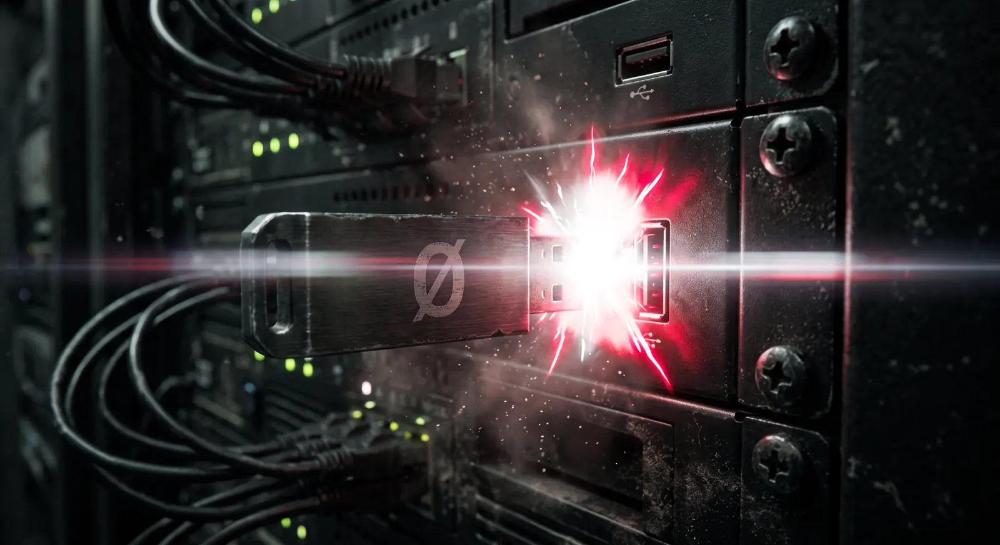

# The interactive installer

<p align="center">
  
</p>

> [!WARNING]
> **THIS IS A DESIGN, NOT A DESCRIPTION. Most of it is not built.**
>
> Read it as intent. What actually exists today is in
> [REDO.md](../../REDO.md) and [ROADMAP.md](../../ROADMAP.md), which mark every
> item built / partial / missing.
>
> Two sections have since been overtaken by reality and are kept for their
> reasoning, not their conclusions:
>
> * **The writing itself is no longer ours.** Sambuca launches Raspberry Pi
>   Imager and supplies an image list; it does not implement device selection,
>   download, verification or writing. The 855 lines that did are deleted.
> * **"The desktop app"** throughout means a graphical program that does not
>   exist. The flow it describes runs in a console today.
>
> The beacon, the account setup and the unified control panel remain unbuilt
> and remain wanted.

A decision document for the desktop app. Every section is measured against the
three standing principles, and where they pull against each other the conflict
is named rather than smoothed over.

> **1. User-friendliness** — a complete novice, taken by the hand, start to finish.
> **2. Security** — a fortress that can also be unbricked.
> **3. Perfected setup** — hardened variants, ephemeral by construction, lean.

The brief this answers: guide the user into their BIOS and onto the USB; connect
the desktop app to the machine being installed so they can watch and understand
it from a chair; let them set up accounts and avatars while the install runs; and
finish by handing them every link, ready to bookmark.

---

## 1. Getting into the BIOS — the step that loses most people

The install itself is already automatic. **The step that actually defeats
novices is the one before it**: a machine that boots straight past the USB, a
boot menu key that differs per vendor, Secure Boot, and Fast Startup on Windows
silently making "shut down" not a shutdown at all.

Nothing downstream matters if the user never gets the stick to boot.

### DECIDED — a per-vendor boot guide, shipped as data

The app asks one question — *what machine are you installing onto?* — and gives
the exact key, the exact wording that vendor uses, and the traps specific to it.

The table ships **in the repository**, not fetched, so it works on a machine with
no internet and cannot break because a page moved. Boot keys are stable, publicly
documented facts; the table is a convenience, and the app always shows the
manual fallback too.

| Vendor | Boot menu | Firmware setup | The trap |
|---|---|---|---|
| Dell | F12 | F2 | "UEFI Boot Path Security" may block a USB |
| HP | F9 or Esc | F10 or Esc | Legacy support off by default on business lines |
| Lenovo ThinkPad | F12 or Enter | F1 | Novo button on some IdeaPads |
| Lenovo IdeaPad | F12 | F2 | Tiny Novo pinhole next to the power button |
| ASUS | Esc or F8 | F2 or Del | Fast Boot must be off |
| Acer | F12 | F2 | F12 boot menu is **disabled by default** — enable it in setup |
| MSI | F11 | Del | — |
| Gigabyte | F12 | Del | — |
| Samsung | Esc | F2 | Hold Esc *before* powering on |
| Toshiba | F12 | F2 | — |
| Microsoft Surface | hold Volume Down | hold Volume Up | No keyboard shortcut at all |
| Apple (Intel) | hold Option | — | Apple Silicon is not supported; say so early |
| Self-built | F11, F12, Del or Esc | Del or F2 | Depends on the motherboard, not the case |

### DECIDED — the search launcher, phrased for a novice

The app opens a search it composes itself, because the phrasing is the hard part:
a novice searching "bios" gets a decade of forum threads for the wrong model.

```
"Dell XPS 15 9520" boot from USB drive BIOS boot menu key
```

Model string in quotes, the vendor's own vocabulary, the specific task. The app
shows the query before opening it, so the user learns the shape of a good search
rather than being handed a magic button.

**Principle 2 applies even here.** The search is the app's *only* outbound
request, it happens in the user's normal browser rather than an embedded
webview, and it carries no identifier of any kind — no machine ID, no install
ID, no telemetry. The user sees the exact URL first. An installer that quietly
phones out while claiming to build a sovereign appliance has lost the argument
before it starts.

### The three traps that are not the boot key

The guide covers these explicitly, because each produces "the USB doesn't work"
with no error message:

1. **Windows Fast Startup.** "Shut down" hibernates the kernel; the firmware
   never re-runs boot selection. Full restart, or disable Fast Startup.
2. **Secure Boot.** Debian's installer is signed and normally fine — so the
   guide says *try first, change nothing*, and only then offers the fallback.
   Telling a novice to disable Secure Boot up front is bad security advice
   given for convenience.
3. **BitLocker.** Changing boot order on a BitLocker machine can trigger a
   recovery-key prompt on the *existing* install. **Find your BitLocker key
   before you touch the firmware** — the guide says this before the boot steps,
   not after, because afterwards is too late.

---

## 2. Watching the install from your own machine

### DECIDED — a discoverable, authenticated beacon

The appliance already serves `/setup` once Caddy is up. That leaves the first
several minutes — disk, base system, Docker — with nothing to watch, which is
exactly the window where an anxious owner power-cycles a machine mid-partition.

So `first-boot` starts a **beacon** before anything else: a tiny read-only HTTP
responder from the Python standard library, no dependencies, running before
Docker exists. It serves the same `progress.json` the setup page already reads,
and hands off to Caddy once the real stack is up.

> **The one dependency that is not "none", and nearly bit.** `http.server` is
> **not** in `python3-minimal`, which is what the package list installed until
> 2026-08-20. Verified against Debian's package contents for trixie:
> `http/server.py` ships in `libpython3.13-stdlib`, and `python3-minimal`'s file
> list does not contain it. The beacon would have failed at the exact moment it
> exists for — the first minutes of a first boot, with nothing else watching.
> `10-system.sh` now installs full `python3` and says why. The base system's
> `standard` task very likely provides it regardless, but an inherited
> dependency is not a declared one.

**Discovery was to be zero-config** via mDNS (`_sambuca._tcp.local`), so the
desktop app would find the machine without anyone typing an IP address.

> **⬜ NOT BUILT — corrected 2026-08-22.** This paragraph described the intent in
> the present tense for long enough to read as a shipped feature. Neither half
> exists: no service-browse discovery is implemented in the flasher, and **no
> mDNS responder is installed on the appliance at all** — not by the preseed's
> `pkgsel/include`, not by `10-system.sh`, and not by Debian's `standard` task.
> `50-network.sh` opens udp/5353 with a comment about `sambuca.local`, and
> nothing answers on it.
>
> What DOES work is the address half: `sambuca-flasher watch` talks to the
> beacon over an authenticated channel, so the machine reports its own progress
> once you can reach it. What is missing is finding it without being told where.
>
> And installing a responder would not finish the job — every address the
> handover hands out is a per-service SUBDOMAIN (`photos.sambuca.local`,
> `vault.sambuca.local`), and mDNS publishes a host, not a zone. The naming
> scheme and this mechanism are incompatible as designed. See ROADMAP.md; it is
> a decision to take, not a package to add.

**And it is authenticated**, which is where principles 1 and 2 pull against each
other. An unauthenticated beacon broadcasting on the LAN would be simpler and is
what most installers would ship. It would also announce, to every device on the
network including a guest phone, that this machine is mid-install and
therefore in its least-defended state.

The resolution costs the user nothing: the flasher generates a **pairing key**,
writes it into `provision.json`, and keeps a copy. The desktop app already has
it. The user types nothing — but the beacon answers only a request that proves
possession of the key.

Beacon rules, in priority order:

- **Read-only. No control surface at all.** It cannot start, stop, retry or
  configure anything. A provisioning-time endpoint that accepts commands is a
  remote-execution hole in the least-hardened window the machine will ever have.
- Binds the LAN only. Never routed, never forwarded.
- Serves progress fields only: stage, timing, plain-language text. No hostnames,
  no secrets, no log contents — a log line can carry a path or a token.
- **Dies at the end of provisioning**, with the port closed and the service
  disabled. Ephemeral by construction, principle 3: a thing that only needs to
  exist for an hour should not survive the hour.

### DECIDED — explain what is being installed, as it happens

Each stage already states what/how long/what you do/what next. The desktop app
adds the *why*, at the depth the user chooses:

- **Plain** — "Setting up the program that keeps your photos and files running."
- **Curious** — what Docker is, in four sentences.
- **Technical** — the actual package list and the phase script.

Written once, in `STAGE_INFO`, and shown by both the console and the app. One
source of wording; three registers.

---

## 3. Accounts and avatars, set up while you wait

The install takes 30–90 minutes and needs nothing from the user. That is dead
time the app can spend usefully — the household's accounts get created while the
machine builds itself, instead of becoming a chore afterwards.

In the app: how many people, their names, an avatar each, and who is an admin.
It is written into `provision.json` and applied by a provisioning phase.

**What is honestly automatable, and what is not:**

| Service | Account creation | Avatar |
|---|---|---|
| Nextcloud | ✅ `occ user:add` | ✅ |
| Immich | ✅ admin API | ✅ |
| Pocket ID | ⚠️ user record yes — **passkey enrolment cannot be automated** | n/a |
| Vaultwarden | ⚠️ invitation, the user sets their own password | n/a |
| Synapse | ✅ registration shared secret | ✅ |

The middle column is where an installer is tempted to lie. A passkey is created
by the person's own authenticator; anything claiming to pre-provision one has
put a password-equivalent secret on disk instead. So those two are presented as
**invitations waiting** — the app shows exactly who still needs to finish, and
the companion walks each person through it on their own device.

**Avatars are processed locally**, stripped of EXIF (which carries GPS), resized
and re-encoded. A family photo used as an avatar should not ship its
coordinates into three databases.

---

## 4. One control panel, admin only

Every service today has its own admin page at its own address, which is exactly
the sprawl a novice cannot navigate. The companion becomes the **single front
door**: one URL, everything reachable from it, everything else linked rather
than memorised.

- **Admin-only, and gated by the existing zero-trust gate** — no second auth
  system. It fails closed like everything else behind it.
- **Non-admin users see their own things**: their files, their photos, their
  passwords. They never see the machine's controls.
- Dangerous controls stay where they are. The panel links to them; it does not
  reimplement them. A control panel that wraps `cryptsetup` is a control panel
  that will eventually wrap it wrongly.

---

## 5. The finish: every link, ready to bookmark

The completion report already prints the addresses. The app does three better
things with them:

1. **A verified list.** Each link is *fetched and checked before it is shown*.
   An installer that hands over ten URLs and lets the user discover which two are
   broken has wasted the trust it just built.
2. **A one-click bookmarks import.** The app writes a Netscape-format
   `sambuca-bookmarks.html` — the format every browser on earth imports — with a
   Sambuca folder containing every service, correctly named. No copy-pasting ten
   addresses on a phone.
3. **The two addresses that matter, said plainly:** the LAN one for home, the
   tailnet one for everywhere else, and which to use when.

Alongside them: install the CA certificate, print the recovery sheet if it is
not already printed, and **verify the recovery key** — `sambuca-recovery verify`
— while the user is still sitting there with the sheet in hand. That is the one
moment they will ever be perfectly positioned to test it.

---

## What this does NOT become

- **Not a remote-control channel.** The desktop app watches and explains. It
  cannot drive the appliance. Once installation ends, the beacon is gone and the
  appliance is reachable only the normal way.
- **Not a telemetry pipe.** The app makes exactly one outbound request in its
  life — a search the user sees first, in their own browser.
- **Not an account escrow.** Passwords the app collects go straight to the
  appliance and are held nowhere else.

---

## Build order

~~1. Boot guide + search launcher~~ — ✅ built (`sambuca-flasher boot-guide`).
~~2. Bookmarks export + verified link list~~ — ✅ built, and `handover` now also
   offers to take the secrets back off the installer USB.
3. **Beacon + pairing key ✅; mDNS discovery ⬜.** The beacon and its
   authenticated pairing key ship; discovery does not, and cannot be finished
   without the naming decision above.
4. Account and avatar setup, with the invitations honestly labelled. ⬜
5. The explanation layer at three depths. ⬜
6. The unified control panel, once the companion substrate exists. ⬜

*Status marked 2026-08-22. Items 1 and 2 had been built for some time while this
list still read as though nothing had started — the same present-tense drift
that made "discovery is zero-config" look like a feature.*
